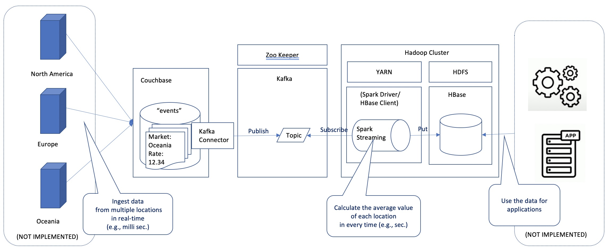
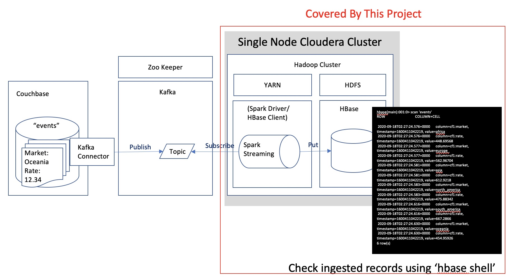

# Kafka, Spark streaming, and HBase

This is a simple example of the integration of Kafka, Spark Streaming, and HBase.

## Concept Overview




## Project Coverage and Related Project


The rest is covered by [another project](https://github.com/YoshiyukiKono/couchbase_kafka)

(This project itself does not necessarily expect that the data source of Kafka is Couchbase but you can have the entire view for the above technical use-case with these two projects.)

## Environment
This project is tested on the [Single Node CDH Cluster](https://github.com/YoshiyukiKono/SingleNodeCDHCluster).


## How to use this project

### Prerequisites

#### Development
Java 1.8 or newer version required because lambda expression used for few cases

- Java >= 1.8 (Oracle JDK has been tested)
- Maven >= 3

#### Real-time Data Source

- Kafka >= 0.10.1.0

#### Hadoop/Cloudera CDH Cluster

- Apache Spark >= 2.0.2
- HBase = 2.1.0-cdh6.3.2


#### Development Environment

Download Maven
```
$ curl -OL https://downloads.apache.org/maven/maven-3/3.6.3/binaries/apache-maven-3.6.3-bin.tar.gz
$ tar -zxvf apache-maven-3.6.3-bin.tar.gz
$ sudo mv apache-maven-3.6.3 /opt/
$ cd /opt
$ sudo su
$ ln -s /opt/apache-maven-3.6.3/ apache-maven
```
Check Java installation path.
```
$ dirname $(readlink $(readlink $(which java)))
/usr/lib/jvm/java-1.8.0-openjdk-1.8.0.262.b10-0.el7_8.x86_64/jre/bin
```
Edit `/etc/profile`
```
sudo vi /etc/profile
```
Add the following items (Please accordingly change the actual pathes for your environment)
```
export JAVA_HOME=/usr/lib/jvm/java-1.8.0-openjdk-1.8.0.262.b10-0.el7_8.x86_64
export PATH=$PATH:$JAVA_HOME/bin
export CLASSPATH=.:$JAVA_HOME/jre/lib:$JAVA_HOME/lib:$JAVA_HOME/lib/tools.jar 
export PATH=$PATH:/opt/apache-maven/bin
```
Apply the settings to the current process.
```
source /etc/profile
```

### Compile

Use Maven as follows for creating jar files, after you clone this repository,

```bash
$ mvn clean package -DskipTests
```

### Configuration

Edit `config/common.conf`, and change `<Your Kafka Server>` to the IP address of your Kafka server (It must be a private IP if you use AWS).

```
producer {
  ...
  topic: "test-default"

  hosts: [
    "<Your Kafka Server>:9092"
  ]
}
```

### HBase Preperation

Run HBase shell on your CDH server,
```
$ hbase shell
```
Create a table (`events`) with a column family (`cf1`),  
```
> create 'events', 'cf1'
```

### Usage

#### Kafka

Run the Kafka service that you  

#### Spark Streaming

Start the Spark Streaming service and it'll process events from Kafka topic to HBase,

```bash
$ spark-submit --master local[*]  --driver-java-options "-Dconfig=./config/common.conf -Dlog4j.configuration=file:log4j.xml" streaming/target/spark-streaming-0.1.jar
```

### Check

You may insert data to the source of the Kafka topic, while the Spark Streaming service is running. You can check the number of the record using `hbase shell`,

```
> count 'events'
```


